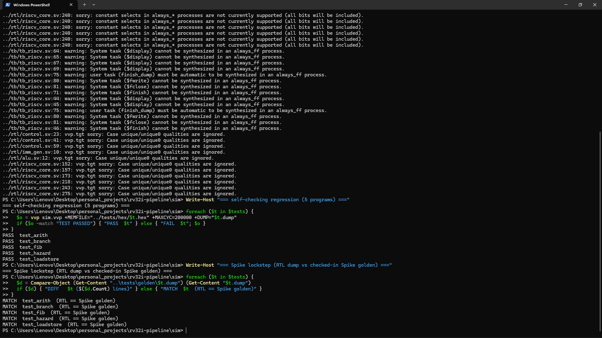
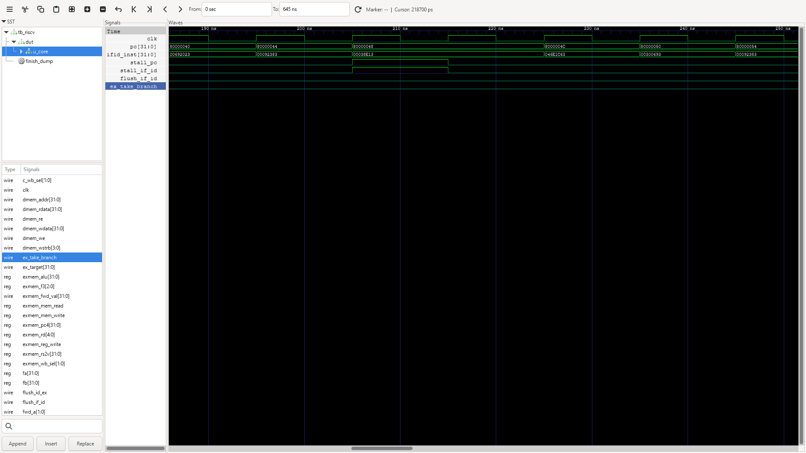

# RV32I 5-stage pipelined processor

A synthesizable RV32I core with a classic 5-stage pipeline (IF/ID/EX/MEM/WB),
full data forwarding, load-use hazard detection, and branch resolution in EX.
Tests are built with the RISC-V GNU toolchain, and the RTL is checked in
lockstep against Spike, all running in CI on open-source tools.


## Demo

All five test programs passing self-checked, then Spike lockstep: the RTL
register file matches the checked-in Spike-derived golden dump for every program.



A load-use hazard in GTKWave: `stall_pc`/`stall_if_id` pulse high for one cycle
(the interlock holding the front end) while `pc` waits.



## Features

- Full RV32I base integer ISA: LUI, AUIPC, JAL, JALR, all branches,
  loads/stores, and ALU reg/imm ops.
- EX-input forwarding from EX/MEM and MEM/WB, a 1-cycle load-use interlock, and
  a 2-cycle flush on taken branches/jumps.
- Standard memory map: code at `0x8000_0000`, tohost at `0x8000_1000`, so one
  ELF runs on both the RTL and Spike.

## Microarchitecture

```
        IF              ID                 EX               MEM            WB
   ┌─────────┐    ┌────────────┐    ┌──────────────┐   ┌──────────┐   ┌────────┐
   │  PC      │   │ decode      │   │ forward muxes │   │ data mem │   │  wb    │
   │  imem    │──▶│ regfile rd  │──▶│ ALU           │──▶│ ld/st    │──▶│  mux   │
   │  +4      │   │ imm gen     │   │ branch/target │   │ extend   │   │ rf wr  │
   └─────────┘    └────────────┘    └──────────────┘   └──────────┘   └────────┘
       ▲                ▲                  │  │
       │                │   forwarding ◀───┘  │  hazard / load-use
       └── PC redirect ─┴── (EX/MEM, MEM/WB)  └── stall + flush
```

`forwarding_unit.sv` picks each EX operand from the register read, EX/MEM, or
MEM/WB. `hazard_unit.sv` stalls on a load-use dependency and flushes on a taken
branch/jump. `regfile.sv` hard-wires `x0` and has write-first bypass. JALR
targets are `(rs1 + imm) & ~1`.

## Layout

```
rv32i-pipeline/
├── rtl/                    # core + datapath (riscv_core.sv, riscv_soc.sv, ...)
├── tb/tb_riscv.sv          # self-checking testbench
├── tests/
│   ├── asm/*.s             # self-checking assembly programs
│   ├── golden/*.dump       # golden register dumps from Spike
│   └── link.ld             # linker script
├── scripts/compare_regs.py # rebuild + diff the register file from a Spike log
├── sim/Makefile
└── docs/                   # architecture + FPGA notes
```

## Prerequisites

- Icarus Verilog (`iverilog` ≥ 12), Verilator, Python 3
- RISC-V GNU toolchain: `sudo apt-get install gcc-riscv64-unknown-elf` (or
  `brew install riscv-gnu-toolchain`)
- Spike (`riscv-isa-sim`): build from
  [riscv-isa-sim](https://github.com/riscv-software-src/riscv-isa-sim) or
  `brew install riscv-isa-sim`

## Running it

```bash
cd sim
make hex          # assemble tests/asm/*.s with the GNU toolchain
make all          # build, run every test, expect "TEST PASSED"
make run TEST=test_fib   # single test with a register dump
make equiv        # lockstep: RTL register file vs Spike
make golden       # regenerate tests/golden/*.dump from Spike
make lint         # Verilator lint
```

### Test programs

| Test | Exercises |
|------|-----------|
| `test_arith` | ADD/SUB, logicals, shifts, SLT/SLTU, immediates |
| `test_branch` | All branch conditions, JAL/JALR, loops |
| `test_loadstore` | LB/LH/LW/LBU/LHU, SB/SH/SW, sign/zero extension |
| `test_hazard` | Back-to-back forwarding, load-use stalls, store-data forwarding |
| `test_fib` | Iterative + recursive Fibonacci (stack, nested calls) |

Each program writes `1` to the `tohost` symbol on success, or `(testid<<1)|1`
on the first failing check.

## Verification

Every test is self-checking through the `tohost` mechanism. `make equiv` also
runs each test on the RTL and on Spike, rebuilds the architectural register
file from Spike's commit log (`scripts/compare_regs.py`), and diffs it against
the RTL's register dump. Verilator (`-Wall`) lints all RTL.

## FPGA synthesis

[`docs/fpga_notes.md`](docs/fpga_notes.md) covers a Vivado flow for an Artix-7
target (`constraints.xdc` included) and the RTL change needed to map the
combinational-read memories to registered block RAM.

## Waveforms

Simulation dumps `tb_riscv.vcd` (GTKWave/Surfer); `+TRACE` prints a
per-instruction retire trace.

## Credits

The RTL (pipeline, forwarding, hazard detection, register file, ALU, decode),
the testbench, the assembly tests, and the verification approach are my own
work. It uses the RISC-V GNU toolchain, Spike, Icarus Verilog, and Verilator.
